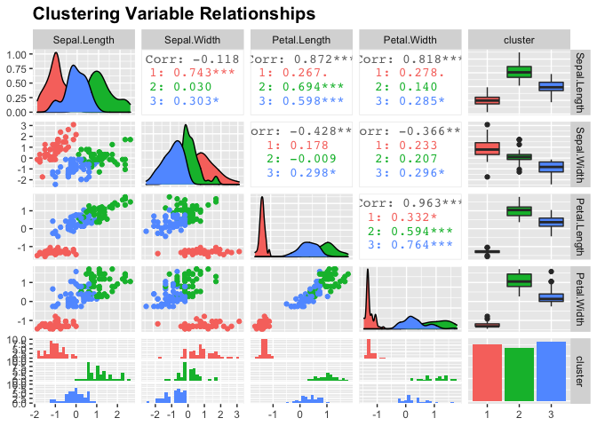
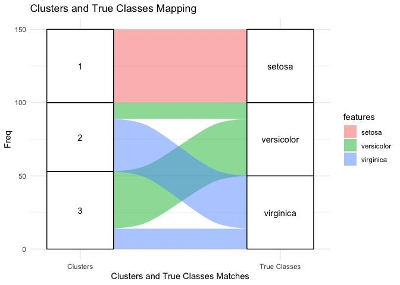
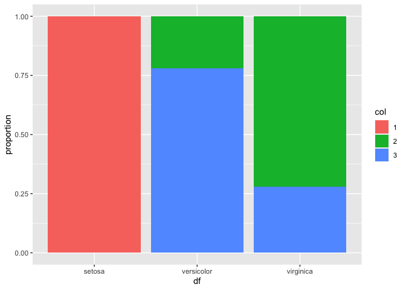
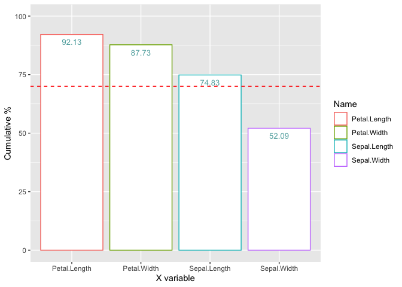
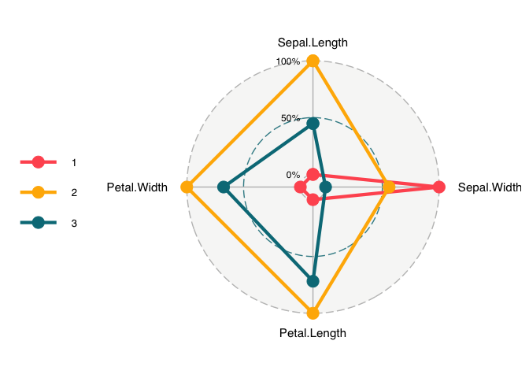
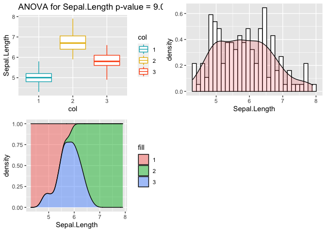
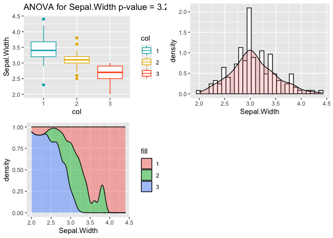
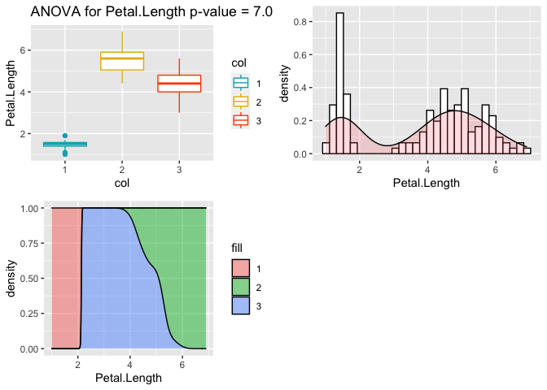
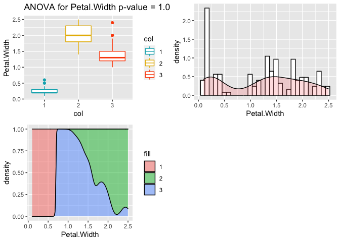

---


## R Markdown

Tutorial for the Package :


Load all the packages needed


```r
devtools::install_github("Mathias-dcm/CCarac", dependencies = TRUE)
```

```
## Skipping install of 'CCarac' from a github remote, the SHA1 (445a70db) has not changed since last install.
##   Use `force = TRUE` to force installation
```

```r
library(mlr)
```

```
## Loading required package: ParamHelpers
```

```
## 'mlr' is in maintenance mode since July 2019. Future development
## efforts will go into its successor 'mlr3' (<https://mlr3.mlr-org.com>).
```

```r
library(tidyverse)
```

```
## ── Attaching packages ─────────────────────────────────────── tidyverse 1.3.0 ──
```

```
## ✓ ggplot2 3.3.2     ✓ purrr   0.3.4
## ✓ tibble  3.0.4     ✓ dplyr   1.0.2
## ✓ tidyr   1.1.2     ✓ stringr 1.4.0
## ✓ readr   1.4.0     ✓ forcats 0.5.0
```

```
## ── Conflicts ────────────────────────────────────────── tidyverse_conflicts() ──
## x dplyr::filter() masks stats::filter()
## x dplyr::lag()    masks stats::lag()
```

```r
library(ggplot2)
library(GGally)
```

```
## Registered S3 method overwritten by 'GGally':
##   method from   
##   +.gg   ggplot2
```

```r
library(plotly)
```

```
## 
## Attaching package: 'plotly'
```

```
## The following object is masked from 'package:ggplot2':
## 
##     last_plot
```

```
## The following object is masked from 'package:stats':
## 
##     filter
```

```
## The following object is masked from 'package:graphics':
## 
##     layout
```

```r
library(ggradar)
library(scales)
```

```
## 
## Attaching package: 'scales'
```

```
## The following object is masked from 'package:purrr':
## 
##     discard
```

```
## The following object is masked from 'package:readr':
## 
##     col_factor
```

```r
library(dplyr)
library(purrrlyr)
library(factoextra)
```

```
## Welcome! Want to learn more? See two factoextra-related books at https://goo.gl/ve3WBa
```

```r
library(stats)
library(maxmatching)
library(igraph)
```

```
## 
## Attaching package: 'igraph'
```

```
## The following object is masked from 'package:plotly':
## 
##     groups
```

```
## The following objects are masked from 'package:dplyr':
## 
##     as_data_frame, groups, union
```

```
## The following objects are masked from 'package:purrr':
## 
##     compose, simplify
```

```
## The following object is masked from 'package:tidyr':
## 
##     crossing
```

```
## The following object is masked from 'package:tibble':
## 
##     as_data_frame
```

```
## The following objects are masked from 'package:stats':
## 
##     decompose, spectrum
```

```
## The following object is masked from 'package:base':
## 
##     union
```

```r
library(ggalluvial)
library(CCarac)
```

load the dataset Iris and proceed a k-means clustering


```r
data("iris")
head(iris)
```

```
##   Sepal.Length Sepal.Width Petal.Length Petal.Width Species
## 1          5.1         3.5          1.4         0.2  setosa
## 2          4.9         3.0          1.4         0.2  setosa
## 3          4.7         3.2          1.3         0.2  setosa
## 4          4.6         3.1          1.5         0.2  setosa
## 5          5.0         3.6          1.4         0.2  setosa
## 6          5.4         3.9          1.7         0.4  setosa
```

```r
# Remove species column (5) and scale the data
iris.scaled <- scale(iris[, -5])
true_class = iris[,5]
# methods from the package stats
library(stats)
# (kmeans method)
km.res <- kmeans(iris.scaled, 3, nstart = 10)
```

Apply our basic summary function from our package at first, to visualize the clustering results. We just have to call the function and write the object that we want to summarize, which is the output of the k-means algorithm, and the data that the k-means algorithm took for entry :


```r
clust_summary_viz(km.res, data = iris.scaled)
```

```
## `stat_bin()` using `bins = 30`. Pick better value with `binwidth`.
## `stat_bin()` using `bins = 30`. Pick better value with `binwidth`.
## `stat_bin()` using `bins = 30`. Pick better value with `binwidth`.
## `stat_bin()` using `bins = 30`. Pick better value with `binwidth`.
```

<!-- -->

As you can see, it gives us a graphic output of the summary of the km.res object, linked to the original datas that we used for our kmeans. It is simply a way for us to visualize directly the informations provided by our initial object and our data.

Let's visualize the clustering in 3D, by calling the clust_viz_3d function :


```r
clust_viz_3d(km.res, data = iris.scaled)
```

```
## Warning: `arrange_()` is deprecated as of dplyr 0.7.0.
## Please use `arrange()` instead.
## See vignette('programming') for more help
## This warning is displayed once every 8 hours.
## Call `lifecycle::last_warnings()` to see where this warning was generated.
```

<!--html_preserve--><div id="htmlwidget-9b98a0eccbfc4c57c450" style="width:672px;height:480px;" class="plotly html-widget"></div>
<script type="application/json" data-for="htmlwidget-9b98a0eccbfc4c57c450">{"x":{"visdat":{"135ee7397e13b":["function () ","plotlyVisDat"]},"cur_data":"135ee7397e13b","attrs":{"135ee7397e13b":{"x":{},"y":{},"z":{},"color":{},"alpha_stroke":1,"sizes":[10,100],"spans":[1,20],"type":"scatter3d","mode":"markers","size":2,"inherit":true}},"layout":{"margin":{"b":40,"l":60,"t":25,"r":10},"scene":{"xaxis":{"title":"Dim.1"},"yaxis":{"title":"Dim.2"},"zaxis":{"title":"Dim.3"}},"hovermode":"closest","showlegend":true},"source":"A","config":{"showSendToCloud":false},"data":[{"x":[-2.25714117564812,-2.07401301519962,-2.35633511180618,-2.29170678586969,-2.38186270441694,-2.06870060846769,-2.43586844896314,-2.22539188878055,-2.32684532934132,-2.17703490524111,-2.15907699169141,-2.31836413068181,-2.21104369651138,-2.62430901614356,-2.19139921180902,-2.25466120656894,-2.20021676474336,-2.18303613482144,-1.89223283955538,-2.33554476060373,-1.90793124870237,-2.19964383149332,-2.76508142263295,-1.81259715939387,-2.21972701347505,-1.9453292965767,-2.04430276805828,-2.16133649609411,-2.1324196468793,-2.25769799459942,-2.1329764658306,-1.82547924518686,-2.60621686662319,-2.43800983169391,-2.10292986441444,-2.20043722941984,-2.03831765277669,-2.5188933857287,-2.42152025669397,-2.16246624829547,-2.27884081437545,-1.85191835739607,-2.54511203326143,-1.95788857468867,-2.12992356350138,-2.06283361485803,-2.37677076236148,-2.38638171322235,-2.2220026321765,-2.19647503956574],"y":[-0.4784238321249,0.67188268702736,0.34076642462457,0.595399862681544,-0.644675659400538,-1.48420529734216,-0.0474851180619341,-0.222403001919441,1.11160369953792,0.467447568511675,-1.04020586652043,-0.132633998989619,0.726243183014105,0.958296347155325,-1.85384655467596,-2.6773152297366,-1.47865572874822,-0.487206130572491,-1.40032756669724,-1.12408359716535,-0.407490576373024,-0.921035870798149,-0.456813300649985,-0.0852728542835459,-0.136796175435074,0.623529705191237,-0.241354990963108,-0.525389421812538,-0.312172004849262,0.336604248179115,0.502856075454753,-0.422280388971236,-1.78758727225369,-2.14354679598505,0.458665270064084,0.205419224155595,-0.659349230133028,-0.590315163413794,0.901161066871611,-0.267981199458594,-0.440240540884853,2.3296107445884,0.477501017242029,-0.470749612673081,-1.13841546420688,0.708678586118923,-1.11668869086624,0.384957230015238,-0.994627668981273,-0.00918558495616492],"z":[0.127279623706425,0.233825516725969,-0.0440539001701694,-0.0909852971013869,-0.0156856472969148,-0.0268782497996201,-0.334350296509764,0.0883993518857503,-0.144592465411111,0.252918267547932,0.267784000872887,-0.0934461909382654,0.23014024594834,-0.180192423003718,0.471322025191649,-0.0304246837413437,0.00532625064254733,0.0440676856273166,0.373093376996302,-0.132187625923035,0.419885937091614,-0.159331501855541,-0.331069982281695,-0.0343734415693189,-0.117599566269891,0.304620475361622,-0.0860756493830084,0.206125707452621,0.270244894709766,-0.068207275501795,0.0747579955015448,0.269564311154481,-0.0470707273478915,0.0823920241071484,0.169706329468824,0.224688851510583,0.482919584243914,-0.0193709180745432,-0.192609402447173,0.175296560742487,-0.034778398118878,0.203552303356679,-0.30474552674038,-0.308567587687829,-0.247604064444311,0.0637163697901236,-0.0570268129544688,-0.139002234137448,0.18088679201615,0.152518539142896],"type":"scatter3d","mode":"markers","name":"1","marker":{"color":"rgba(102,194,165,1)","size":[55,55,55,55,55,55,55,55,55,55,55,55,55,55,55,55,55,55,55,55,55,55,55,55,55,55,55,55,55,55,55,55,55,55,55,55,55,55,55,55,55,55,55,55,55,55,55,55,55,55],"sizemode":"area","line":{"color":"rgba(102,194,165,1)"}},"textfont":{"color":"rgba(102,194,165,1)","size":55},"error_y":{"color":"rgba(102,194,165,1)","width":55},"error_x":{"color":"rgba(102,194,165,1)","width":55},"line":{"color":"rgba(102,194,165,1)","width":55},"frame":null},{"x":[1.0981024376141,0.728895557392423,1.23683580437726,0.744037147588114,0.872484287235821,0.735219594653773,0.871354535034469,1.25231374884778,1.35386953241309,0.427706259711288,1.04522644526925,1.83841002292412,2.19790360928039,1.43534213399666,1.86157576812763,2.74268508518824,2.29475181232994,1.99998632720977,2.25223216150761,1.35962063642439,1.59732747466913,1.87761053154946,1.58476819655716,1.46651848761418,2.41822769929905,3.29964147766837,2.03091255525826,2.88797650048304,1.69505530435101,1.9478013897869,1.01754169126033,1.7823787852455,1.85742500656318,2.4278203037876,2.29723178140912,1.85648382607218,2.78942561198209,1.57099293753804,1.34179695884536,1.8458612446819,2.00808316432958,1.89543420912849,2.03374499291101,1.99147546765771,1.86425785551097,1.51609145206078,1.36820417808844],"y":[-0.860091033195535,-0.592629362111237,-0.614239893586152,-0.770438272131435,-0.507364239317829,-0.395247446203699,-0.249956016963885,0.0769980689934507,-0.330205462736721,-0.842758920031796,-0.520308714210875,-0.867515056090058,-0.560133976020063,0.0468307008961816,-0.29405969708425,-0.797736708755223,-0.418663019534745,0.709063225701762,-1.91459630053529,-0.690443404779255,0.420292430984473,-0.417849814808663,-0.673986886879845,-0.254768326848431,-2.54812479540878,-0.0177215803758506,-0.90742744316955,-0.412259950365689,-1.01053647601085,-1.00441271999451,-0.0641311838009081,0.186735632829046,-0.560413289172776,-0.258418706409728,-2.61755441714645,0.177953334381455,-0.853942542447134,-1.06501321386332,-0.421020154124069,-0.673870645014123,-0.611835929575559,-0.687273065463849,-0.864624029927367,-1.04566566980122,-0.385674037719237,-0.268170747298158,-1.0078779335796],"z":[0.682300392827053,0.0938074518286077,0.552157057816727,-0.148472007474925,0.501830203735072,-0.614467782024027,0.471001057024938,0.724727098589451,0.259955700981099,-0.449129445970655,0.394464890324338,-1.00204407662394,0.202236658096735,-0.163083761041605,-0.394307408012252,0.580364826606626,0.64953045175197,0.392675072750673,-0.396224508463666,-0.283661780373449,-0.0231089906391434,-0.0262504680313075,-0.636297053688594,-0.0373062803641925,0.127454475100886,0.700957032559935,-0.234015509847078,0.854558972725137,-0.297454113548938,0.418582431787049,-0.336588365127889,-0.269754304275589,0.713244682459556,0.725386034897286,0.491826144304202,-0.352966242354698,0.541093784857856,-0.942695700249272,-0.180271551367532,0.0126298037893678,-0.426902678382514,-0.129640697037223,-0.337014968924898,-0.630301865865372,-0.255418177714635,-0.179576781190784,-0.930278720805816],"type":"scatter3d","mode":"markers","name":"2","marker":{"color":"rgba(252,141,98,1)","size":[55,55,55,55,55,55,55,55,55,55,55,55,55,55,55,55,55,55,55,55,55,55,55,55,55,55,55,55,55,55,55,55,55,55,55,55,55,55,55,55,55,55,55,55,55,55,55],"sizemode":"area","line":{"color":"rgba(252,141,98,1)"}},"textfont":{"color":"rgba(252,141,98,1)","size":55},"error_y":{"color":"rgba(252,141,98,1)","width":55},"error_x":{"color":"rgba(252,141,98,1)","width":55},"line":{"color":"rgba(252,141,98,1)","width":55},"frame":null},{"x":[0.406122510582316,1.07188379008136,0.387389545478408,-0.485695616574381,0.924803460629363,0.0113880377498813,-0.109828344816525,0.439222014327709,0.560231478811453,0.717159338099527,-0.0332433349106715,0.349082210079204,0.158279795491531,1.22100315925959,0.164367253777666,0.474696912074162,1.23005729116914,0.630745144729911,0.700315062452439,0.662580660303281,-0.0401241911233272,0.130358462507397,0.0233743826118043,0.240731799007045,1.05755171211093,0.223230929109033,1.04104379073867,0.0693559721501832,0.282530734014849,0.278145961180111,0.622484410746876,0.335406726359697,-0.360974087805562,0.287622676070302,0.0910556108775121,0.226956539987921,0.574463781482267,-0.446172300268022,0.255873389202737,1.15401555362078,0.365792249755623,1.25590769146092,1.46274486947042,1.25954707363401,0.974715347055718,1.3287806370817,1.17118006924396,1.11042770445578,1.19845835457099,0.921737011706326,1.15401555362078,1.55935649354476,0.957448488427993],"y":[1.74854619671187,0.207725147460289,0.591302716817181,1.84624399751416,-0.032118477998473,1.03056578377106,2.6452111149372,0.0630838516595658,1.75883212917366,0.185602819101217,0.437537418877909,0.195656267831571,0.789451008029531,1.61682728111498,1.2982599385868,0.415926887402994,0.930209440537512,0.41499744081119,0.063200093525288,0.225173502489749,1.05518358327439,1.55705555308923,1.5672252436853,0.774661195431319,0.631726900780829,0.286812662909877,1.3783710478047,0.218770433320693,1.32488614708228,1.11628885212114,-0.0248398135650891,0.985103828097625,2.0124958247898,0.85287311561658,0.180587142080645,0.383634868447845,0.154356488603594,1.53863745561893,0.596852285411121,0.696536400516362,1.55628917778441,1.15837974138599,0.440794883463618,1.70104671545086,0.569855256629258,0.480202495565157,0.315338060438006,0.291944581796171,0.808606364209224,-0.0171655941132701,0.696536400516362,0.893692854598663,0.024250426980428],"z":[0.0230246331483334,0.396925784161216,-0.123776885423919,-0.248432992127572,0.594178807029566,-0.537100054976857,0.0466342150944942,-0.204389092830244,0.763214553815946,0.068429699556232,-0.194282030432383,-0.48923409473208,0.301028700258913,0.480693655581168,0.172260718980622,0.264067575555737,0.367182177555927,0.290921637861052,0.444537764647719,-0.0855771971585293,0.318506304212031,0.14948269738103,0.240745760570681,0.15070707432178,-0.104959761607682,-0.663028512445553,0.68599780356006,-0.290605718131696,-0.0891114911448736,-0.094172115654536,0.0204127625201703,0.198724011357842,-0.105467721124232,-0.130452656802428,-0.128547696306392,-0.155691572238897,0.270743346934245,-0.189765199308186,-0.0915723849817519,-0.528389993558481,-0.983598122154437,-0.578311891090577,-1.00051774610063,0.266643612314985,-0.825362161276583,0.00541023902539489,-0.129503906867403,0.182875740895033,0.164173760001166,-0.415434448874084,-0.528389993558481,0.0262833001289519,-0.526485033062446],"type":"scatter3d","mode":"markers","name":"3","marker":{"color":"rgba(141,160,203,1)","size":[55,55,55,55,55,55,55,55,55,55,55,55,55,55,55,55,55,55,55,55,55,55,55,55,55,55,55,55,55,55,55,55,55,55,55,55,55,55,55,55,55,55,55,55,55,55,55,55,55,55,55,55,55],"sizemode":"area","line":{"color":"rgba(141,160,203,1)"}},"textfont":{"color":"rgba(141,160,203,1)","size":55},"error_y":{"color":"rgba(141,160,203,1)","width":55},"error_x":{"color":"rgba(141,160,203,1)","width":55},"line":{"color":"rgba(141,160,203,1)","width":55},"frame":null}],"highlight":{"on":"plotly_click","persistent":false,"dynamic":false,"selectize":false,"opacityDim":0.2,"selected":{"opacity":1},"debounce":0},"shinyEvents":["plotly_hover","plotly_click","plotly_selected","plotly_relayout","plotly_brushed","plotly_brushing","plotly_clickannotation","plotly_doubleclick","plotly_deselect","plotly_afterplot","plotly_sunburstclick"],"base_url":"https://plot.ly"},"evals":[],"jsHooks":[]}</script><!--/html_preserve-->


In our Iris dataset, we do have the true features of the observation, that is why we can compute our external measures. If you do not have the true features, you can skip the external part of this tutorial.
We can find a contingency table of the true classification and the clustering results, that's what we are going to do with the clust_class_viz function, by computing the clustering object first, and then the true features :


```r
clust_class_viz(km.res, true_class)
```

<!-- -->


Now, let's go ahead for the matching measures, by calling the matching measures function with the same parameters as before. Just as an example, let's take a look to the parameters of the next two functions. In fact, they are giving the same results, we can compute any one you want, as long as the features are provided. Indeed, if you are writing the object, the script will automatically find the clusters inside the object if those exists. It means that in contrary, you can write object = NULL if you are writing by yourself the clusters as the third parameter. It gives :


```r
#matching_measures(object = NULL, iris[,5], km.res$cluster)
matching_measures(km.res,iris[,5])
```

```
## $`Purity of Clustering`
## [1] 0.8333333
## 
## $`Maximum Matching`
## [1] 0.8333333
## 
## $`Clusters Precision`
## Cluster 1 Cluster 2 Cluster 3 
## 1.0000000 0.7659574 0.7358491 
## 
## $`Clusters Recall`
##    1    2    3 
## 1.00 0.72 0.78 
## 
## $`Clusters F-measure`
## Cluster 1 Cluster 2 Cluster 3 
## 1.0000000 0.7422680 0.7572816 
## 
## $`F-measure`
## [1] 0.8331832
```

We can now watch the purity, the maximum matching and the F-measure of the clusters, as the precision and the recall are done to calculate the F-measure. 

The 0.83 purity means that 83% of the observations grouped by the clustering algorithm belongs to the same partitions (in terms of initial features).

The maximum matching is the same as the purity measure, except that only one cluster can match one unique partition. 

The maximum matching measure is the fraction of points in a cluster Ci from the majority partition, except that in this case, one cluster can match only one unique partition


The 0.83 F-measure is the harmonical mean of the precision and the recall. By itself, the F-measure is not really meaningful, because it represent the combination of several metrics. Of course, the closest is the F-measure to 1, to better it is, but We need to observe the precision and the recall to really analyze the results, depending on the goal that we want to achieve.

 

We can do the same thing for external entropy measures :


```r
entropy_measures(km.res, iris[,5])
```

```
## $`Conditional Cluster Entropy`
## Cluster 1 Cluster 2 Cluster 3 
## 0.0000000 0.7849921 0.8329458 
## 
## $`Conditional Entropy`
## [1] 0.5402717
## 
## $`Normalized mutual information`
## [1] 0.659487
## 
## $`Variation of information`
## [1] 1.078811
```

About the conditional entropy, the more a cluster's members are split into several partitions, the higher the conditional entropy. A perfect clustering compared to the real features gives a conditional entropy of 0. This is a probability measure.

The normalized mutual information is quantifying the amount of shared informations between the clustering and the partitioning. It is a measure of the dependence between the observed joint probability and the expected joint probability, with a independence assumption. The value is in the range [0,1], with a value of 1 for the perfect clustering case.


The variation of information is pretty linked to the mutual information, we will actually use the results of the normalized mutual information to compute it. The lower the score, the better the clustering.


Now, it's time to go for our internal measures, which don't need the true features to be working. First, we'll be interested about uni-variate measures. Let's start with the Khi-2 statistic, which is going to give us the Cramer's V. It we will be compute by calling the Khi2 function, with two different qualitative data (of same length) that we want to compare. In this particular case, we will compare the clustering features with the true features, but just as an example. Of course, it doesn't mean that you need to have the true features to compute your Khi-2 test, of course not. You could compare any qualitative value with another, it could be a comparison with the clustering features and any qualitative variable. In our case, it is :


```r
Khi2(iris[,5],km.res$cluster)
```

```
## [1] 0.790855
## [1] "There is a liason between these twos"
```

<!-- -->

We can see in the results that our Cramer's V (0.79) is indeed significative, there is a liaison between the two variables.


Now, let's use the graphique.MoyCon function to understand how the variable have contributes to the formation of the groups. We also give you a threshold that you can set. For example, if you are setting the threshold at 80%, you could keep only the variables that are superior or equals to 80%, and say that this is the most relevant variables for the formation of the groups.


```r
obj <- Univarie.MoyCon(iris[,-5],km.res$cluster)
graphique.MoyCon(obj,seuil=70)
```

<!-- -->

In this case, we see for example that 93.13% of the informations contained by the variable Petal.Length have been used to form the groups.


Let's see now see what we can tell about the variable means by clusters. For that, we are going to call the function clust_radar_viz, by directly declaring the data and the cluster parameters. That's why we just have to tell our function that data is equal to NULL, because we already provide it the clusters. Indeed, the object is needed only if we want to find automatically the clusters. In this case, we provide directly our clusters with the argument km.res$cluster. 

```r
clust_radar_viz(object = NULL, data = iris.scaled, clusters=km.res$cluster)
```

```
## Warning: `funs()` is deprecated as of dplyr 0.8.0.
## Please use a list of either functions or lambdas: 
## 
##   # Simple named list: 
##   list(mean = mean, median = median)
## 
##   # Auto named with `tibble::lst()`: 
##   tibble::lst(mean, median)
## 
##   # Using lambdas
##   list(~ mean(., trim = .2), ~ median(., na.rm = TRUE))
## This warning is displayed once every 8 hours.
## Call `lifecycle::last_warnings()` to see where this warning was generated.
```

<!-- -->

The graph is giving us some interesting insights about the means of the variables by clusters. Indeed, we can see that depending the the cluster, the means of the different variables are not equivalent at all. For example, in comparison to the others, the cluster number 3 is characterized by a significantly larger mean of the Sepal Width, with a really small mean for the three other variables. It means that in the cluster 3, you will be most likely to find flowers with larger and smaller sepals.


Now, let's find out the liaison between our quantitative variables to our clusters by calling the TestQuanti function with the parameters 


```r
TestQuanti(iris[,-5],km.res$cluster)
```

```
## [1] "Test ANOVA for Sepal.Length"
##              Df Sum Sq Mean Sq F value Pr(>F)    
## col           2  76.46   38.23   218.6 <2e-16 ***
## Residuals   147  25.71    0.17                   
## ---
## Signif. codes:  0 '***' 0.001 '**' 0.01 '*' 0.05 '.' 0.1 ' ' 1
```

```
## `stat_bin()` using `bins = 30`. Pick better value with `binwidth`.
```

```
## [1] "Test ANOVA for Sepal.Width"
##              Df Sum Sq Mean Sq F value Pr(>F)    
## col           2  14.74   7.372    79.9 <2e-16 ***
## Residuals   147  13.56   0.092                   
## ---
## Signif. codes:  0 '***' 0.001 '**' 0.01 '*' 0.05 '.' 0.1 ' ' 1
```

```
## `stat_bin()` using `bins = 30`. Pick better value with `binwidth`.
```

<!-- -->

```
## [1] "Test ANOVA for Petal.Length"
##              Df Sum Sq Mean Sq F value Pr(>F)    
## col           2  427.8  213.90   860.6 <2e-16 ***
## Residuals   147   36.5    0.25                   
## ---
## Signif. codes:  0 '***' 0.001 '**' 0.01 '*' 0.05 '.' 0.1 ' ' 1
```

```
## `stat_bin()` using `bins = 30`. Pick better value with `binwidth`.
```

<!-- -->

```
## [1] "Test ANOVA for Petal.Width"
##              Df Sum Sq Mean Sq F value Pr(>F)    
## col           2  75.95   37.98   525.7 <2e-16 ***
## Residuals   147  10.62    0.07                   
## ---
## Signif. codes:  0 '***' 0.001 '**' 0.01 '*' 0.05 '.' 0.1 ' ' 1
```

```
## `stat_bin()` using `bins = 30`. Pick better value with `binwidth`.
```

<!-- --><!-- -->

We find our ANOVA test the p-value is <5%, which means that the variable that we are interested about is correlated to the categorical data, that is why We can watch the graph now. The boxplot show us the distribution of the quantitative variable throughout the categorical variable. Besides that, the second one shows the distribution of the quantitative variable where we can find that whether the trend is following the normal distribution. And the last one shows the density of each categorical value for the quantitative variables. In facts, we can find 4 different tests output and 4 different pages of graphs, because we asked your function to compute 4 different quantitative variables (iris[,5]==iris[,0:4]) to the categorical one.


Finally, we can't end this tutorial with the last internal measures, which is now multivariate. Indeed, we are going to measure how well the clusters are separated to each others, and how compact they are. Let's call the dunn_index function with the clustering object first, and then the data used for our k-means. 


```r
dunn_index(km.res, data = iris.scaled)
```

```
## [1] 0.02649665
```


We can see that the Dunn index is around 0.02, which is pretty low. Remember that the Dunn index is between ]0 and +Inf[. We will surely have a better value of the Dunn index by increasing k. By fact, it is notable that this measure is kind of insensitive, and not perfectly efficient by itself in this case to judge our clustering quality.


